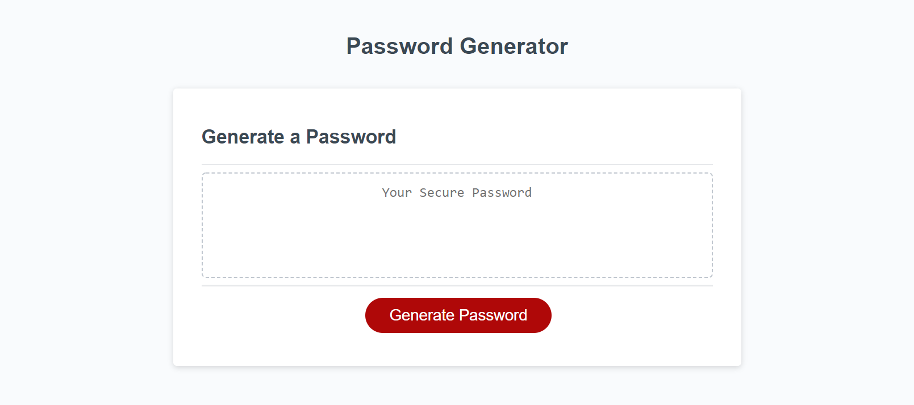

#<password-creator-secure>

## Description-
This project is a password generator with multiple content character options to choose from.  In today's technology age, password security is paramount.  The app streamlines the creations  of new passwords by creating one for the user at the click of a button.

JavaScript is a tough language, and I definitely had to push myself.  The hardest part was implementing a formula to randomize the characters.  Noting the proper syntax and formation of the formula was a challenge, but it felt really good once it was implemented.  

In addition, I think this assignment forced me to be patient.  This was a challenge at times as I do like feeling like a go getter with assignments.  But slowing down helped in the long term for this project.  

## Contributors-
I worked with my classmate Sam, we helped each other with the syntax formation and looking for other ways to complete the program's requirements.  I also received help from my instructor John and TA Michael.

## Testing-
If you would like to try the program, you can find the link here at https://mrmrc182.github.io/password-creator-secure/ 

Hit the red "generate password" as seen on the red button in the screenshot below.  You the user will be asked to input the length of your desired password.  Make sure it is from 5-128.  You will then be asked if you would like to include lowercase letters, uppercase letters, numbers, or special characters.  You must say "Yes" to at least one.  

## License-
Matt Carlson Code 2022